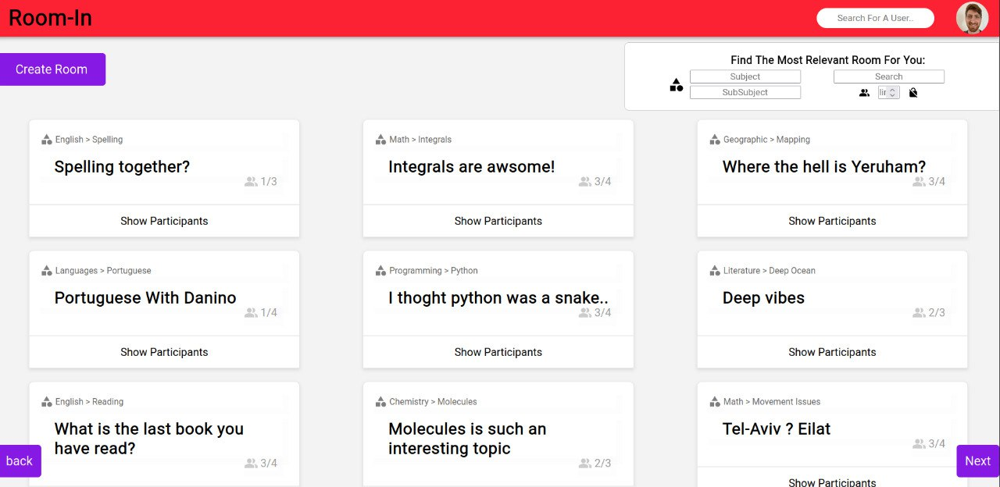

# [Roomin](https://roomin.dankner.be/)

This is our Cyber4s Full-Stack Bootcamp Final Project:

 - [@Amit Mor](https://github.com/amit751)
 - [@Ben Hanover](https://github.com/benhanover)
 - [@Gil Dankner](https://github.com/DGorgula)

## Links:

[Roomin repository](https://github.com/benhanover/Cyber4sCourseFinalProject)

[Roomin Presentation](https://docs.google.com/presentation/d/1Tk7i7qi9-urq4pEYiRvPVotNom1-SXNbd-LTpv258V8/edit?usp=sharing)

### Welcome To Room-in!

The place where you can find study partners in a click of a button, and study within the most ideal environment that was designed for an optimal learning experience.

Room-in provides you the environment you need in order to maximize productivity. We offer video chat rooms that you can either create or join by prefrences such as subject and room capacity. Create your own uniqe profile to let other users know you better.

Overcome the difficulty of studying alone by meeting new people that share your interests. We encourge you to travel rooms, expand and share youre knowledge, and most of all have fun doing that!

## Our Home Landing Page is the Lobby:

In the upper-left side of the page you will find the "Create Room" button that will open up a form with the following fields:
 - Title
 - Subject
 - Subsubject
 - Description
 - Participants Limit
 - Lock Button (to add a password if you wish)

In the upper-right side of the page you will find the filtering section, there you can filter the presented rooms by the following fields:
 - Title
 - Subject
 - Subsubject
 - Participants Limit
 - Locked/Unlocked

In the main section of the page you will find all of the filtered available rooms.

### Note

Every user has its own unique customized profile, so you can check on other users to pick the most suitable room for you.
For example, Here is our beloved Mock User - Danino:

## The Video Room

The design of the Video Room is inspired by the Zoom application, with small spicy adjustments such as the background.

The features of the video room are:
 - Mute/Unmute self.
 - Show/Hide self video.
 - Share screen.
 - Multiple share screens.
 - Resize picked video to fullscreen.
 - Close/Open Room for new participants.
 - Leave Room.

## Main Technologies:
 

